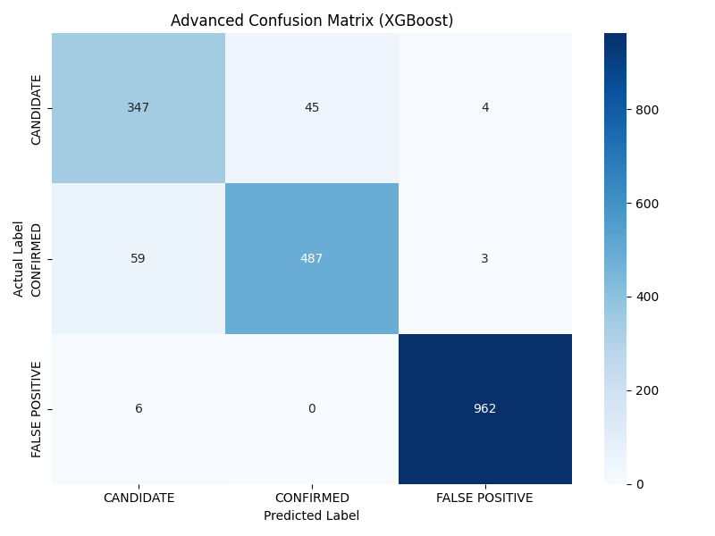
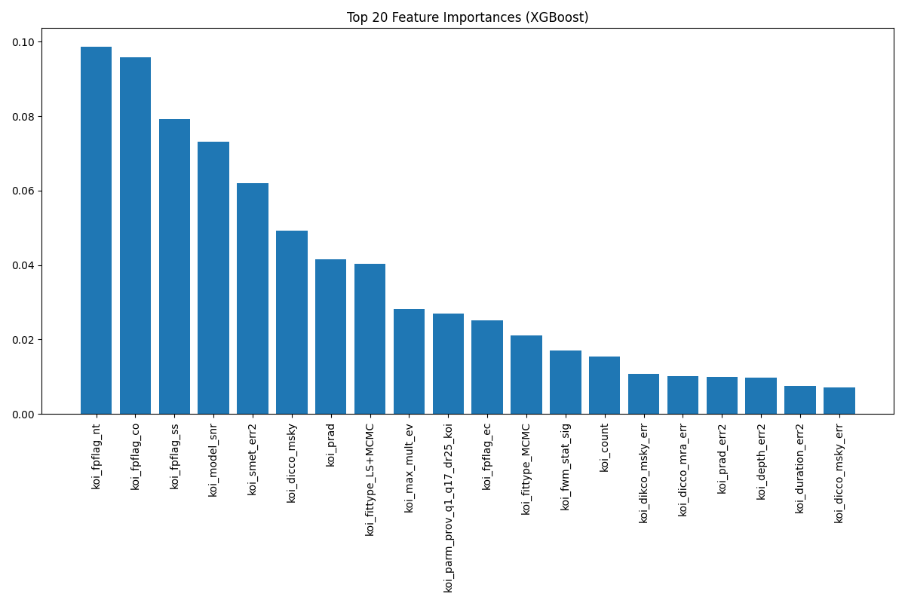

# 🌌 ExoVision AI: High-Precision Kepler Exoplanet Classification

[](https://www.python.org/downloads/)
[](https://xgboost.readthedocs.io/)
[]()

> **Built for the Celesta India High School Exoplanet Data Challenge on Devpost.**

ExoVision AI is an end-to-end machine learning solution designed to identify exoplanets using NASA's Kepler Space Telescope dataset (`KOI_Cumulative_clean.csv`). By employing advanced data preprocessing, SMOTE class balancing, and hyperparameter-tuned XGBoost classification, ExoVision AI classifies Kepler Objects of Interest (KOIs) into **CONFIRMED**, **CANDIDATE**, or **FALSE POSITIVE** with **93.88% accuracy**.

---

## 📊 Performance Overview

| Metric | Baseline (Random Forest) | **Advanced (XGBoost + SMOTE)** |
| :--- | :---: | :---: |
| **Overall Accuracy** | 92.47% | **93.88%** |
| **False Positive Recall** | 100% | **99%** |
| **Candidate Recall** | 78% | **88% 🚀 (+10%)** |
| **Confirmed Recall** | 90% | **89%** |

---

## 🛠️ Key Technical Features

1. **Target Leakage Prevention**: Automatically identifies and removes features (e.g. `koi_pdisposition`) that contain retroactive disposition tags.
2. **SMOTE Class Resampling**: Balances the class distribution to prevent model bias towards majority false positives, boosting recall on rare exoplanet candidates.
3. **Hyperparameter Tuning**: Utilizes `GridSearchCV` to optimize tree depth, learning rate, and subsample ratios.
4. **Automated Asset Export**: Saves model weights (`exoplanet_xgboost_model.pkl`), scalers, encoders, and evaluation plots.

---

## 📁 Repository Structure

```
.
├── KOI_Cumulative_clean.csv       # NASA Kepler Cumulative Dataset
├── train_model_advanced.py        # Advanced XGBoost + SMOTE Training Pipeline
├── train_model.py                 # Baseline Random Forest Training Script
├── advanced_feature_importances.png# Feature Importance Plot
├── advanced_confusion_matrix.png  # Confusion Matrix Plot
├── exoplanet_xgboost_model.pkl    # Saved Trained XGBoost Model
├── advanced_scaler.pkl            # Fitted StandardScaler
├── advanced_label_encoder.pkl     # Target Label Encoder
├── DEVPOST_SUBMISSION.md          # Ready-to-use Devpost Copy
└── README.md                      # Project Documentation
```

---

## 🚀 Getting Started

### Prerequisites

Ensure Python 3.8+ is installed. Install required packages:

```bash
pip install pandas numpy scikit-learn xgboost imbalanced-learn matplotlib seaborn joblib
```

### Run Model Training

To train the advanced XGBoost model with SMOTE & Grid Search:

```bash
python train_model_advanced.py
```

To run the baseline Random Forest model:

```bash
python train_model.py
```

---

## 📈 Visualizations

### Confusion Matrix


### Top 20 Feature Importances


---

## 📜 License
This project is open-source and available under the [MIT License](LICENSE).
