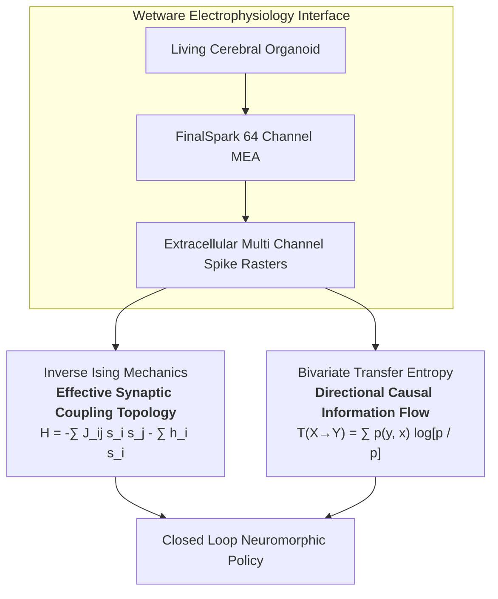

# Biological-AI-Core: Organoid Intelligence and Wetware Computing Architecture

[](https://opensource.org/licenses/MIT)
[](#)
[](#)
[](#preseed-funding-and-compute-roadmap)

> **Bypassing the Thermodynamic Wall of Silicon.**  
> Modern deep learning compute has collided with a physical wall: megawatt datacenter clusters running dense matrix multiplication to approximate basic intelligence. In contrast, 3D biological cerebral organoids compute, adapt, and self organize at a thermodynamic cost of **~20 Watts**.  
>  
> **Biological-AI-Core** is the unified monorepo consolidating my 10 peer reviewed research papers, open source algorithms, and electrophysiological signal processing pipelines engineered to interface with living human brain organoids for biocomputation.

---

## Core Theoretical and Mathematical Framework

My biological computing architecture processes live microelectrode recordings from the **FinalSpark Microelectrode Array (MEA)** across 16, 32, and 64 channel extracellular electrophysiology platforms:



### 1. Maximum Entropy and Inverse Ising Mechanics
I map multielectrode spiking time bins into instantaneous spin configurations $s \in \lbrace -1, +1 \rbrace^N$. To reconstruct the latent functional connectome without confounding indirect correlations, I solve the inverse problem for the pairwise maximum entropy Boltzmann distribution:

$$
P(s) = \frac{1}{\mathcal{Z}} \exp \left( \sum_{i < j} J_{ij} s_i s_j + \sum_{i} h_i s_i \right)
$$

Through Persistent Contrastive Divergence (PCD) and pseudolikelihood maximization, my algorithms fit the effective synaptic coupling matrix $J_{ij}$ and local intrinsic excitabilities $h_i$ to assess organoid criticality and functional plasticity.

### 2. Bivariate Transfer Entropy (TE) for Causal Information Flow
To quantify nonlinear, directed information routing between neural assemblies, I compute bivariate transfer entropy across MEA channel pairs:

$$
T_{X \to Y} = \sum_{y_{t+1}, y_t, x_t} p(y_{t+1}, y_t, x_t) \log_2 \left( \frac{p(y_{t+1} \mid y_t, x_t)}{p(y_{t+1} \mid y_t)} \right)
$$

By applying spike jittering surrogate null models, I isolate true directional synaptic transmission from shared volume conduction and external stimulus artifacts.

---

## Preseed Funding and Compute Roadmap

I am a 16 year old independent researcher and the sole author behind the research publications and codebases unified in this repository.

> [!IMPORTANT]
> **I am currently raising a \$60,000 Preseed round.**

### Capital Allocation:
1. **Hardware (\$25k to \$30k):**
   - High throughput local compute hardware required to parallelize exact Inverse Ising likelihood solvers, Markov Chain Monte Carlo (MCMC) sampling, and combinatorial Bivariate Transfer Entropy channel scans.
2. **Physical Wetware Incubation and Perfusion Rig (\$20k):**
   - Microfluidic perfusion chambers and automated environmental controllers to extend organoid viability for multiday closed loop reinforcement learning protocols.
3. **Electrophysiology and Stimulation Hardware (\$10k to \$15k):**
   - FinalSpark cloud API access compute credits, high speed DAC stimulation generators, and low noise analog signal filters.

*Inquiries from angel investors, neurotechnology funds, and academic collaborators are welcome via email or GitHub issues.*

---

## Repository Index and Architecture

This monorepo consolidates my core research pillars:

| Module / Directory | Focus Area and Methodology | Artifacts |
| :--- | :--- | :--- |
| [`wetware_thermodynamics/`](./wetware_thermodynamics) | Nonequilibrium thermodynamic efficiency, Inverse Ising solvers, and Landauer dissipation limits | Paper and Pipeline |
| [`wetware_causal_logic/`](./wetware_causal_logic) | Bivariate Transfer Entropy and directional information routing in wetware networks | Paper and Code |
| [`wetware_scaling_laws/`](./wetware_scaling_laws) | Power law avalanche distributions, Zipf's law, and Self Organized Criticality (SOC) | Paper and Code |
| [`wetware_geometry_chaos/`](./wetware_geometry_chaos) | Attractor dynamics, Lyapunov spectrum, and phase space reconstruction | Paper and Code |
| [`wetware_reservoir_memory/`](./wetware_reservoir_memory) | Liquid state computing, echo state memory retention, and biological state readout | Paper and Benchmarks |
| [`bio_logic_gates/`](./bio_logic_gates) | Bidirectional electrostimulation encoding and biological Boolean logic gates | Paper and Code |
| [`Detection-Limit-in-OI/`](./Detection-Limit-in-OI) | Microelectrode resolution boundaries and SNR limits for in vitro intelligence | Research Paper |
| [`Preliminary-Computational-Analysis-...`](./Preliminary-Computational-Analysis-of-Frequency-Dependent-Complexity-i) | Spectral decomposition and multiscale Lempel Ziv complexity on MEA channels | Research Paper |
| [`organoid-intelligence-book/`](./organoid-intelligence-book) | Comprehensive 14 chapter technical treatise, mathematical proofs, and protocols | Monograph and Book |

---

## Quickstart

```bash
# Clone the unified master repository
git clone https://github.com/Anikesh0415/Biological-AI-Core.git
cd Biological-AI-Core

# Setup environment
python -m venv venv
.\venv\Scripts\activate   # Windows
# source venv/bin/activate # Linux/macOS

# Install dependencies
pip install numpy scipy numba matplotlib networkx h5py
```

---

## Citation

```bibtex
@software{BiologicalAICore2026,
  author = {Anikesh Tiwari},
  title = {Biological-AI-Core: Unified Organoid Intelligence and Wetware Computing Architecture},
  year = {2026},
  publisher = {GitHub},
  howpublished = {\url{https://github.com/Anikesh0415/Biological-AI-Core}}
}
```

**Contact:** [GitHub Profile](https://github.com/Anikesh0415) | `babitatiwari7249@gmail.com`
