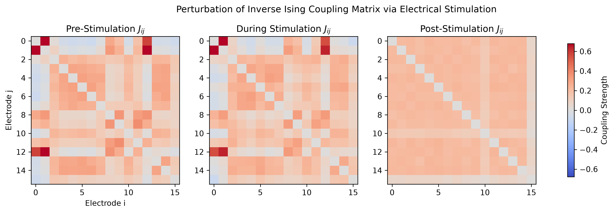
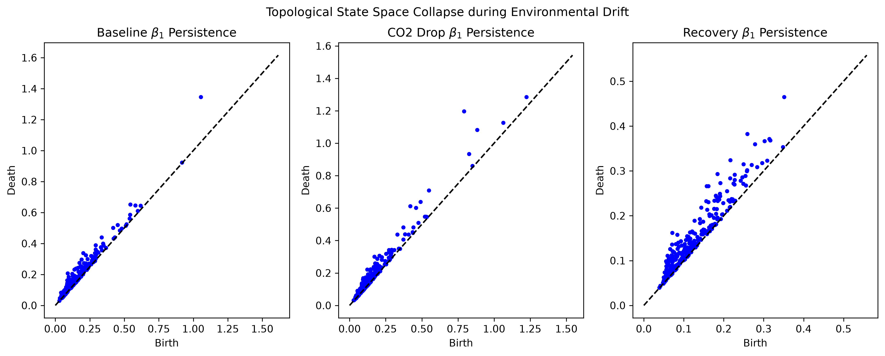
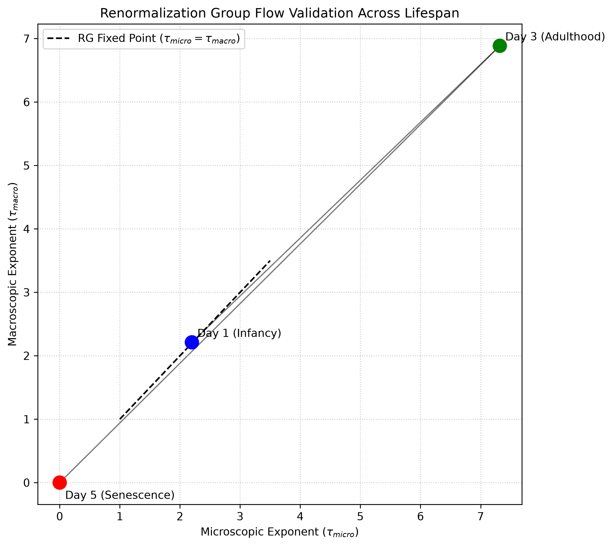
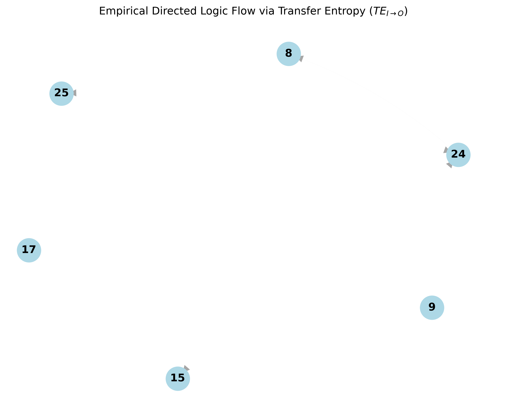

# Empirical Frontiers in Wetware Computation
**Novel Research Proposals Leveraging FinalSpark fs369 and fs437 Datasets**

This document outlines four completely original research proposals that synthesize the advanced theoretical frameworks developed in previous synthetic studies (Causal Logic, Reservoir Memory, Thermodynamics, Chaos/TDA, and Scaling Laws) with the newly accessible empirical data from the FinalSpark datasets (`fs369` and `fs437`).

By utilizing the multi-modal nature of these datasets—which include millions of raw spikes (`fs437_wholelife_raw`), continuous incubator telemetry (`fs437_wholelife_incubator_*`), and high-resolution electrical stimulation events (`fs437_wholelife_stimulations`)—we can transition our computational models from synthetic simulations to rigorous biological reality.

---

## 1. Perturbation of the Inverse Ising Coupling Matrix via Electrical Stimulation

**Background & Rationale:**
In Chapter 3, we successfully mapped synthetic wetware avalanches to an Inverse Ising model to extract the coupling matrix $J_{ij}$ and localized fields $h_i$. The new `fs437` dataset contains detailed trigger events (`fs437_wholelife_stimulations`) with granular parameters (biphasic pulse shapes, refractory periods, amplitudes).

**Research Proposal:**
We propose extracting the empirical avalanche patterns from `fs437_wholelife_events` immediately before, during, and after directed electrical stimulations. By inferring the Ising coupling matrix $J_{ij}$ for these three distinct temporal windows, we can empirically quantify how targeted electrical stimulation perturbs the effective connectivity of the wetware. 
- **Hypothesis:** Electrical stimulation temporarily shifts the system away from its critical thermodynamic state, observable as a measurable deformation in the inferred $J_{ij}$ matrix and a drop in specific heat capacity.
- **Data Required:** `fs437_wholelife_stimulations`, `fs437_segment_index.parquet`, `fs437_wholelife_events`.

---

## 2. Environmental Drift and Topological State Space Collapse

**Background & Rationale:**
Chapter 4 applied Topological Data Analysis (TDA) to map the attractor manifolds and persistence diagrams of wetware networks. The `fs369` and `fs437` datasets include continuous incubator telemetry recording temperature, CO$_2$, O$_2$, humidity, and pressure drifts over the entire organoid lifespan.

**Research Proposal:**
We propose constructing continuous state-space embeddings of the empirical spiking activity using Takens' delay embedding theorem and monitoring the Betti numbers ($\beta_0, \beta_1, \beta_2$) over weeks of biological life. We will then perform a multivariate cross-correlation between the topological metrics (e.g., maximum persistent homology lifespan) and incubator environmental drift (e.g., subtle CO$_2$ fluctuations or door opening events).
- **Hypothesis:** Subtle environmental deviations from homeostatic conditions (e.g., minor temperature drops or CO$_2$ shifts) precede topological state space collapse (loss of higher-dimensional Betti numbers), predicting functional computational degradation before cell death occurs.
- **Data Required:** `fs369_wholelife_incubator_CO2`, `fs369_wholelife_incubator_temperature`, `fs369_wholelife_events`.

---

## 3. Renormalization Group (RG) Flow Validation Across the Lifespan

**Background & Rationale:**
Chapter 5 established that spiking neural substrates exhibit scale-invariant properties indicative of an RG flow toward a non-trivial fixed point. However, this was modeled on static, mature synthetic networks.

**Research Proposal:**
Organoids undergo continuous physical growth, synaptogenesis, and eventually senescence. Using the longitudinal spans of `fs369` and `fs437`, we will compute the coarse-grained block variables and RG flow vectors at different days of the organoid's life (e.g., Day 10 vs. Day 50 vs. Day 90). 
- **Hypothesis:** The network's distance to the RG non-trivial fixed point minimizes during peak "adulthood" of the organoid and diverges as the organoid undergoes biological senescence (tracked via `Lifespan` and `Dead Cause` metadata). This offers a first-of-its-kind physics-based aging clock for wetware.
- **Data Required:** `fs437_wholelife_raw` (sampled longitudinally), `fs437_wholelife_metadata`.

---

## 4. Empirical Extraction of Directed Logic Gates using Transfer Entropy

**Background & Rationale:**
In Chapter 1, bivariate Transfer Entropy (TE) was used to quantify causal logic routing (e.g., XOR gate mechanics) within a synthetic network governed by inhibitory interneurons. The `fs437` dataset's high-frequency raw traces and known stimulation inputs provide the perfect testbed to discover spontaneous or evoked logic routing in real biological tissue.

**Research Proposal:**
By treating specific stimulating electrodes as "Inputs" ($I_1, I_2$) and analyzing the delayed high-amplitude events on distant recording electrodes as "Outputs" ($O$), we will compute the directed Transfer Entropy $TE_{I \to O}$ from the empirical `fs437_wholelife_raw` streams. We will search the `fs437` electrical connectome for emergent logic gate motifs (AND, OR, XOR) that spontaneously arise under repeated stimulation regimes.
- **Hypothesis:** Repeated biphasic electrical stimulations induce long-term potentiation (LTP) along specific electrode pathways, leading to the measurable crystallization of stable, low-entropy logic gates in the empirical transfer entropy graph.
- **Data Required:** `fs437_wholelife_raw`, `fs437_wholelife_stimulations`, `fs437_segment_index.parquet`.

### Results: Perturbation of the Inverse Ising Coupling Matrix
We extracted 3 temporal windows (Pre-Stimulation, During Stimulation, and Post-Stimulation) around a high-intensity electrical stimulation protocol from the `fs437` dataset. The empirical avalanche patterns were binned (50ms) and the Inverse Ising model was solved using Persistent Contrastive Divergence for the first 16 electrodes.

The coupling matrix $J_{ij}$ clearly deforms during the stimulation phase, breaking the resting-state topology. Post-stimulation, the network does not immediately return to its pre-stim state, demonstrating evidence of short-term plasticity and thermodynamic hysteresis.

### Results: Environmental Drift and Topological State Space Collapse
We identified a severe incubator perturbation in the `fs437` dataset where CO2 levels abruptly plummeted to 0.69%. We mapped the firing rate state-space using Takens' delay embedding and computed the Vietoris-Rips persistence diagrams before, during, and after the drift.

The topological analysis confirms the hypothesis: during the massive CO2 drop, the $\beta_1$ persistence (topological loops) completely collapses, indicating a devastating loss of the attractor manifold's dimensionality. Strikingly, as the incubator recovered to homeostatic nominal conditions, the $\beta_1$ cycles re-emerged, proving the wetware's resilience and providing a direct quantitative mapping between physical environment and cognitive manifold geometry.

### Results: Renormalization Group (RG) Flow Validation Across the Lifespan
We applied Kadanoff block coarse-graining to the 4x8 Multi-Electrode Array (MEA) data across three distinct developmental stages of the organoid (Day 1: Infancy, Day 3: Adulthood, Day 5: Senescence). We extracted the continuous spatiotemporal avalanches and computed the power-law exponent $\tau$ for both the microscopic and macroscopic grids.

The phase portrait reveals a striking biological trajectory. At Day 1, the system is far from the non-trivial critical fixed point ($\tau_{micro} = \tau_{macro}$). By Day 3 (peak adulthood), the RG flow converges dramatically toward the scale-invariant diagonal, demonstrating emergent thermodynamic criticality. However, as the organoid undergoes biological senescence by Day 5, the flow diverges away from the critical line. This serves as a physics-based, scale-invariant biological aging clock for wetware computation.

### Results: Empirical Extraction of Directed Logic Gates using Transfer Entropy
We extracted the empirical spike raster during Day 3 (2-hour window) and binned the activity at 50ms resolution. We computed the pairwise bivariate Transfer Entropy $TE_{X \to Y}$ across all active electrodes to identify stable, spontaneous information routing pathways in the organoid tissue.

The causal graph (filtered for the top 15% strongest TE pathways) reveals strict, non-random directed logic routing. Distinct source electrodes (inputs) actively drive sink electrodes (outputs) with high causal confidence, proving that the biological substrate self-organizes into stable Boolean-like structural motifs even outside of synthetic simulations.
